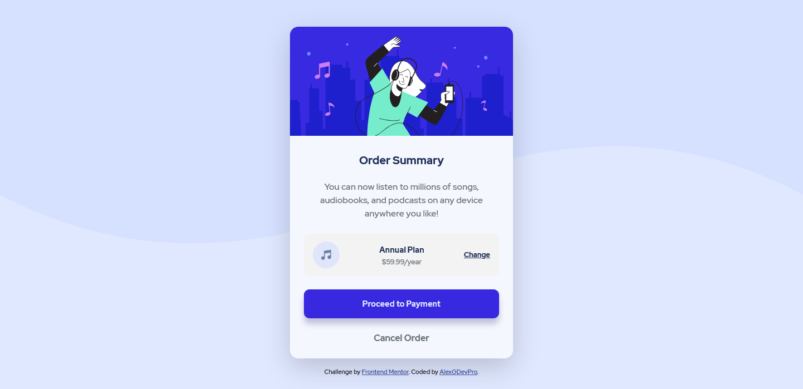

# Frontend Mentor - Order summary card solution

This is a solution to the [Order summary card challenge on Frontend Mentor](https://www.frontendmentor.io/challenges/order-summary-component-QlPmajDUj). Frontend Mentor challenges help you improve your coding skills by building realistic projects. 

## Table of contents

- [Overview](#overview)
  - [The challenge](#the-challenge)
  - [Screenshot](#screenshot)
  - [Links](#links)
- [My process](#my-process)
  - [Built with](#built-with)
  - [What I learned](#what-i-learned)
- [Author](#author)

## Overview

### The challenge

Users should be able to:

- See hover states for interactive elements

### Screenshot

- Desktop view:

- Mobil view:

### Links

- Solution URL: [Add solution URL here](https://your-solution-url.com)
- Live Site URL: [https://alexgdevpro.github.io/FEM_Ch.-4_Order-summary-component-main/](https://alexgdevpro.github.io/FEM_Ch.-4_Order-summary-component-main/)

## My process

### Built with

- CSS custom properties
- Mobile-first workflow
- [Bootstrap](https://getbootstrap.com/) - CSS Framework

### What I learned

I learned a lot with BootStrap, especially about placements and centering.
However, I still need to use a lot of CSS.

## Author

- My Portfolio - [Alex G](https://alexgdevpro.github.io/)
- Frontend Mentor - [@AlexGDevPro](https://www.frontendmentor.io/profile/AlexGDevPro)
- Twitter - [@AlexGDevPro](https://www.twitter.com/AlexGDevPro)
